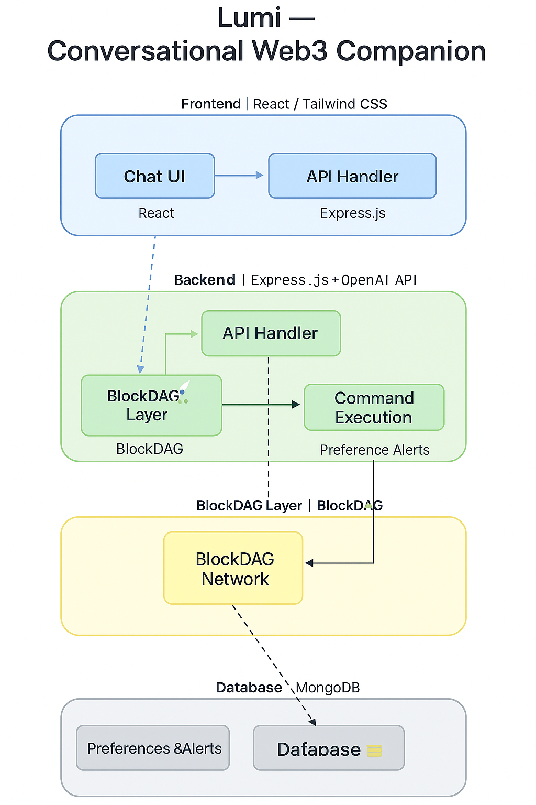

# 🧩 Lumi Architecture Overview

## 🌐 Overview

Lumi — _The Conversational Web3 Companion_ — is designed to provide an AI-powered assistant for DeFi and blockchain users on the **BlockDAG** ecosystem.

It enables seamless interaction between users and decentralized financial tools through natural language, helping users **fetch token prices, swap assets, and manage wallets** via conversational commands.

---

## ⚙️ System Architecture

### 🧭 High-Level Flow

```
User → Chat UI → AI Engine → BlockDAG → Smart Contracts
```

1. **User Interface (Chat UI)**

   - Built with **React.js / Next.js**
   - Handles conversational inputs, displays responses, and visualizes transaction data.
   - Connects to backend via REST API or WebSocket.

2. **Backend (AI Engine)**

   - **Express.js** server integrating:
     - **OpenAI API** for language understanding and intent classification.
     - **BlockDAG SDK / RPC** for blockchain operations.
     - **MongoDB** for caching wallet and session data.
   - Routes requests, validates user intents, and forwards commands to smart contracts.

3. **Blockchain Layer (BlockDAG Network)**
   - Smart contracts deployed on BlockDAG testnet.
   - Handles asset swaps, price fetching, and DeFi operations.
   - Interfaced through Web3.js or Ethers.js.

---

## 🧱 Technology Stack

| Layer           | Technology                | Purpose                     |
| --------------- | ------------------------- | --------------------------- |
| Frontend        | Reactjs                   | Interactive chat interface  |
| Backend         | Node.js (Express.js)      | API and AI middleware       |
| AI              | OpenAI API                | Intent recognition and NLP  |
| Database        | MongoDB                   | Session and cache storage   |
| Blockchain      | BlockDAG (EVM-compatible) | DeFi transaction execution  |
| Smart Contracts | Solidity (Foundry)        | Token swap and wallet logic |

---

## 🧩 Component Diagram



---

## 🚀 Data Flow Summary

1. **User** enters a DeFi query or command in the chat.
2. **Frontend (Chat UI)** sends input → Backend API.
3. **Backend (AI Engine)** processes with OpenAI → extracts intent.
4. Backend interacts with **BlockDAG contracts** for required operations.
5. **Response** (price data, swap confirmation, etc.) sent back to the chat UI.

---

## 🧠 Future Enhancements

- Integration with **WalletConnect / MetaMask** for user authentication.
- AI-driven **portfolio optimization insights**.
- **Multilingual** DeFi interaction.
- Real-time **gas fee estimator** for transactions.

---

**Created by Team Lumi ⚡**  
_BlockDAG ChainRace Buildathon — Wave 1_
